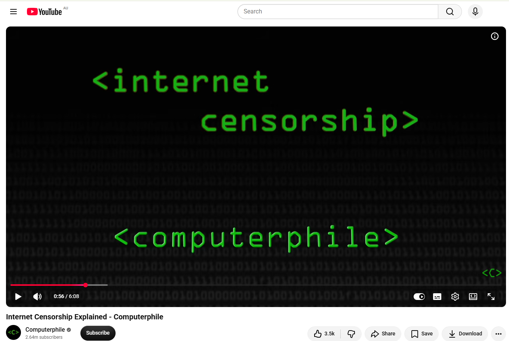
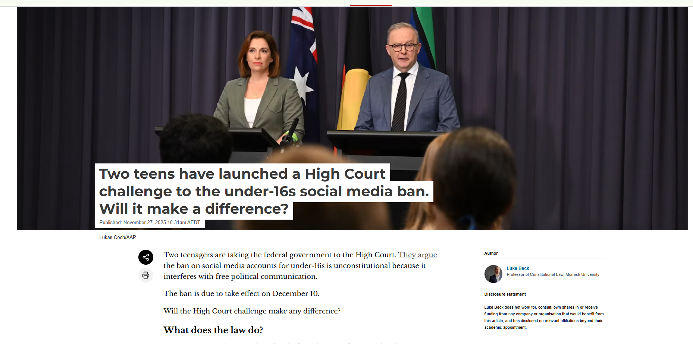
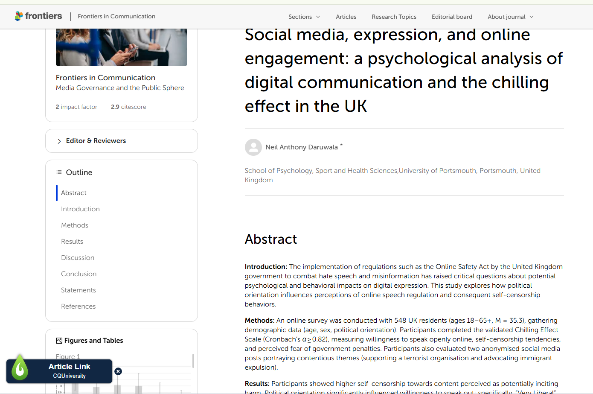
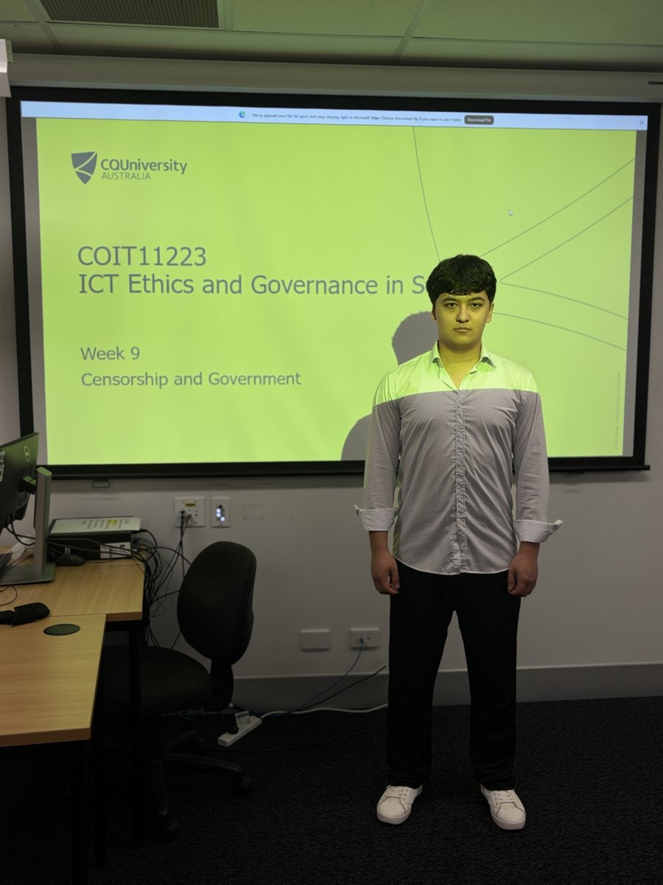

# e-portfolio-4-Censorship-and-Government

A collection of artefacts that demonstrate what I have learnt about Censorship and Government this week

## Artefact 1: What is Internet Censorship?

**Internet Censorship Explained - Computerphile**

https://www.youtube.com/watch?v=6ohH-RkSLo4

### Summary of the artefact

This short video by Computerphile (2016) explains how governments technically restrict access to websites. Sheharbano Khattak, a researcher at the University of Cambridge, explains two common methods: DNS-based blocking, where a DNS server is changed so a blocked domain points to a warning page instead of the real website, and firewall-based IP blocking, where an ISP blocks a specific IP address. She also explains the limits of both methods, for example a website can still be reached directly by its IP address, or by using a different DNS server. In my own words, internet censorship is not one single tool, it is a set of technical methods that governments and ISPs use to make certain content hard to reach, and none of them are perfect.

### Justification on why I chose the artefact

I chose this video because it explains the technical side of censorship we looked at in Workshop 9, especially DNS-based website blocking and firewall-based IP blocking. Before watching it, I understood censorship mostly as a legal or political idea, but this video helped me connect it to how the internet actually works underneath. I also liked that it is only 6 minutes long and made by Computerphile, a channel I already trust for computer science content, so I did not need to search for long to understand the basics. As a cybersecurity student, understanding how blocking is done is also useful for understanding how it can be bypassed, which connects to the workshop discussion about VPNs, Tor and messaging apps.

## Artefact 2: A News Article I Found This Week

**Two teens have launched a High Court challenge to the under-16s social media ban. Will it make a difference?**

https://theconversation.com/two-teens-have-launched-a-high-court-challenge-to-the-under-16s-social-media-ban-will-it-make-a-difference-270688

### Summary of the artefact

This article by Beck (2025) discusses the legal challenge brought by two teenagers and the advocacy group Digital Freedom Project against Australia's ban on social media accounts for under-16s. The plaintiffs argue the ban breaches the implied freedom of political communication in the Australian Constitution, because young people use social media to engage with political issues. The article explains that this implied freedom is not a personal right, it is a limit on the power of parliament to make laws, and any law that burdens political communication must be reasonable and proportionate to a legitimate purpose. The author argues the burden on political communication here is small, since very few under-16s use social media specifically for political content, so the ban is more likely to survive the challenge.

### Justification on why I chose the artefact

I chose this article because it connects directly to the case study in Workshop 9 about Australia's under-16 social media ban, and it let me look deeper into the legal reasoning behind it. I found the idea of an "implied" constitutional right interesting, because Australia has no written bill of rights, so this freedom exists only because judges have interpreted it from the structure of the Constitution. This also connects to the ethical theories we studied earlier, Kant and Mill both opposed censorship in general, but Mill's Harm Principle allows government intervention when there is a risk of harm to others, and protecting children online could be argued as this kind of harm prevention. The article made me think about where the line is between protecting young people and restricting their freedom, which is the same question the workshop slides asked at the end of the case study.

## Artefact 3: Scholarly Article

**Social media, expression, and online engagement: a psychological analysis of digital communication and the chilling effect in the UK**

https://doi.org/10.3389/fcomm.2025.1565289

### Summary of the artefact

The article by Daruwala (2025) studies why people in the UK stay quiet online. It looks at the "chilling effect," where people avoid posting something because they worry about legal trouble or social backlash, especially since the UK introduced its Online Safety Act. The author surveyed 548 UK residents about how willing they are to speak out on social media, and also showed them two real controversial posts to react to, using a legal method called the Brandenburg Test. The results show a clear pattern based on political orientation: 'Very Liberal' participants were the most willing to speak out, while 'conservatives and non-political participants display the highest levels of self-censorship,' mainly because they worry more about being punished by the government under vague rules like "legal but harmful" speech.

### Justification on why I chose the artefact

I chose this article because it studies exactly what we discussed in Workshop 9 about the eSafety Commissioner vs X case and how governments try to regulate harmful online content without accidentally silencing lawful speech. The UK's Online Safety Act works in a similar way to Australia's Online Safety Act mentioned in the lecture, so this gave me a comparison point from another country. I found this article on Frontiers, a journal I recognised from earlier research, and picked it because it is very recent (April 2025) and the page has a clear header image plus graphs showing the survey results by political group, which made the statistics much easier to follow. It also connects to Mill's Harm Principle, since the whole article is really asking where the line is between preventing harm and creating a "chilling effect" that stops people exercising free speech, even when what they want to say is completely legal.

## Artefact 4: Workshop Personal Reflection

**Workshop:** Week 9 – Censorship and Government
**Day and Date:** Tuesday, 15 September 2026
**Tutor:** Khaleel Petrus
**Campus:** CQUniversity Brisbane

*Attendance photo taken in the Week 9 workshop, with the COIT11223 Week 9 "Censorship and Government" lecture slide on the screen behind me.*

### Summary of the artefact: My Personal Reflection

> **WRITE THIS SECTION YOURSELF — replace everything below with your own words.**
> Use these prompts from the workshop slides to guide you:
>
> - Before this week, I thought censorship mainly meant ... What I actually learnt was ...
> - The case study that stood out to me most was [ASIC and Section 313 / the Daily Stormer and Cloudflare case / Australia's under-16 social media ban / the Nepal social media ban], because ...
> - During the workshop discussion, [something your tutor or a classmate said that you found interesting, or disagreed with] ...
> - One of the "What are your thoughts?" questions from the slides was ["Who should regulate internet content, governments or private companies?" / "Are you happy working for a company that will or won't regulate internet content?"]. My own view is ...
> - This connects to Kantianism and Act Utilitarianism from an earlier week. Both Kant and Mill opposed censorship, but Mill's Harm Principle allows some restriction when there is a risk of harm to others. I think ...

### Justification on why I chose the artefact

> **WRITE THIS SECTION YOURSELF** — a short paragraph on why this workshop moment was worth recording, and what it changed in how you think about censorship.

## References in CQU Harvard Style

Beck, L 2025, 'Two teens have launched a High Court challenge to the under-16s social media ban. Will it make a difference?', The Conversation, 27 November 2025, viewed 20 September 2026, https://theconversation.com/two-teens-have-launched-a-high-court-challenge-to-the-under-16s-social-media-ban-will-it-make-a-difference-270688

Computerphile 2016, Internet Censorship Explained - Computerphile, video, 15 April 2016, viewed 20 September 2026, https://www.youtube.com/watch?v=6ohH-RkSLo4

Daruwala, NA 2025, 'Social media, expression, and online engagement: a psychological analysis of digital communication and the chilling effect in the UK', Frontiers in Communication, vol. 10, article 1565289, viewed 20 September 2026, https://doi.org/10.3389/fcomm.2025.1565289
